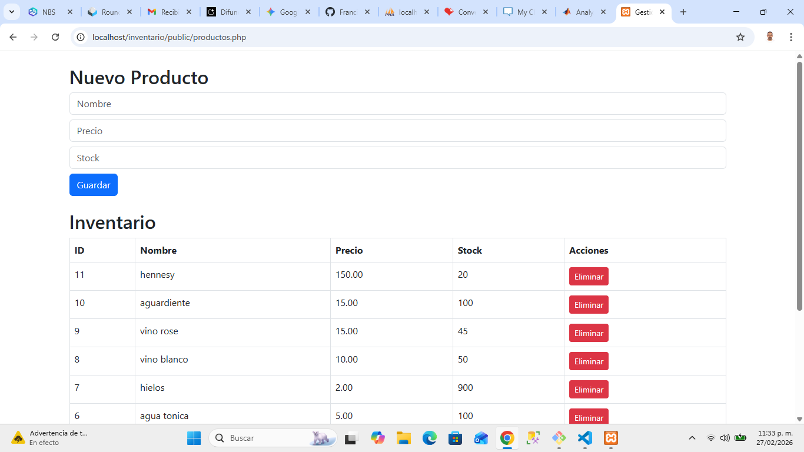
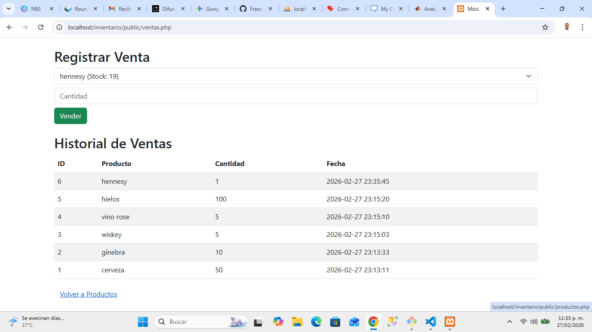

# Sistema de Gestión de Inventario y Ventas V1.0
**Elaborado por: Francisco Jalon Z**

## Descripción
Sistema web desarrollado en PHP para la gestión de productos y registro de ventas con control de stock automatizado.

## Requisitos
- Servidor local (XAMPP/WAMP)
- PHP 7.4 o superior
- MySQL/MariaDB

## Instalación y Configuración
1. Clonar el repositorio.
2. Importar el archivo SQL ubicado en `/database/inventario.sql` en phpMyAdmin.
3. Configurar las credenciales en `/Config/database.php`.

## Script SQL (Base de Datos)
```sql
CREATE TABLE productos (
    id INT AUTO_INCREMENT PRIMARY KEY,
    nombre VARCHAR(100) NOT NULL,
    precio DECIMAL(10,2) NOT NULL,
    stock INT NOT NULL
);

CREATE TABLE ventas (
    id INT AUTO_INCREMENT PRIMARY KEY,
    producto_id INT NOT NULL,
    cantidad INT NOT NULL,
    fecha TIMESTAMP DEFAULT CURRENT_TIMESTAMP,
    FOREIGN KEY (producto_id) REFERENCES productos(id) ON DELETE CASCADE
);

### Gestión de Inventario


### Registro de Ventas

